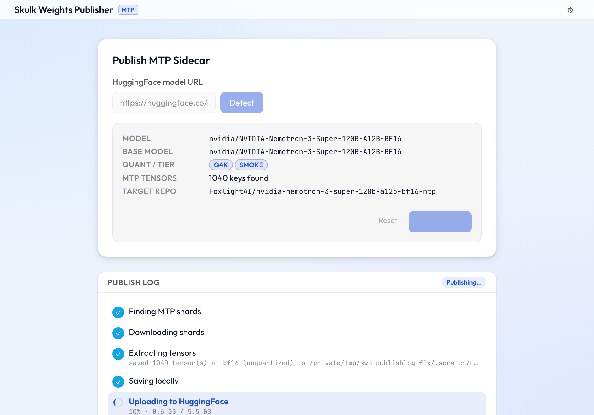

# SWP: Skulk Weights Publisher

Publish Skulk model weights: LARQL vindexes and MTP sidecars.

Documentation: <https://foxlight-foundation.github.io/skulk-weights-publisher/>

Skulk is a distributed LLM inference system. SWP publishes two kinds of model
weights that Skulk clusters consume:

**LARQL vindexes** — LARQL treats model weights as a database, decompiling
transformer weights into a queryable vindex and exposing LQL, the Lazarus Query
Language. A vindex is a vector-index directory published so Skulk does not have
to keep every weight resident in expensive GPU memory: CPU/high-memory LARQL
servers host feed-forward weights while GPU nodes handle the latency-sensitive
inference path.

**MTP sidecars** — Models with native multi-token prediction heads require
those heads to be published separately. Two storage layouts are detected
automatically: new-style `mtp.*` tensor keys (Qwen3, DeepSeek V4-Flash) and
old-style DeepSeek `model.layers.{N}.*` heads stored as the extra transformer
layer beyond `num_hidden_layers` (detected via `num_nextn_predict_layers` in
`config.json`, e.g. DeepSeek V3/V3-0324). Standard quantization pipelines (e.g.
mlx-lm's `sanitize()`) strip MTP tensors. SWP re-extracts them from the original
BF16 checkpoint and publishes them at full precision (bf16, unquantized) as
`mtp.safetensors` to a dedicated Hugging Face repo — one sidecar per base model,
shared across every quantization of it — so Skulk can use speculative decoding.

This repository is the controlled publication workflow. It keeps the catalog
of publishable model weights, validates that catalog, prints the exact commands,
and runs publication from a configured runner.

The Foxlight catalog is included automatically and publishes to the
`FoxlightAI` Hugging Face organization. Each publish is filed into a
per-artifact-type Hugging Face collection — `Vindexes`, `MTP Sidecars`, and
`Vision Sidecars` (see [Collections](#collections)). Operators can add their own catalog files with
`skulk-weights.yaml`; the merged catalog uses namespaced keys such as
`foxlight/gemma-3-4b-full-q4-k` and `my-org/my-model-full-q4-k` so shared
Foxlight entries and local operator entries can coexist safely.

## Why This Exists

Weight publication is expensive and easy to get wrong. A bad command can write
hundreds of gigabytes to the wrong scratch path, publish under the wrong Hugging
Face repository, or silently omit MTP heads that a model needs. This project
makes publication repeatable:

- packaged Foxlight catalog entries describe shared Skulk vindexes published
  under `FoxlightAI`; MTP sidecar entries can be added by operators
- `skulk-weights.yaml` can add operator-owned catalog source files
- `skulk-weights catalog validate` checks the merged catalog
- `skulk-weights publish --dry-run` prints the full publication plan
- GitHub Actions validates every catalog entry
- the self-hosted runner performs real extraction and publication

## Catalog

Vindex entries (all entries currently in the Foxlight catalog):

| Key | Source model | Quant | Slices |
|---|---|---|---|
| `foxlight/gemma-3-4b-full-q4-k` | `google/gemma-3-4b-it` | `q4k` | `full` |
| `foxlight/llama-3-2-3b-full-q4-k` | `meta-llama/Llama-3.2-3B-Instruct` | `q4k` | `full` |
| `foxlight/qwen-2-5-7b-full-q4-k` | `Qwen/Qwen2.5-7B-Instruct` | `q4k` | `full` |
| `foxlight/gemma-4-26b-a4b-full-q4-k` | `google/gemma-4-26b-a4b-it` | `q4k` | `full` |
| `foxlight/gemma-4-26b-a4b-expert-server-q4-k` | `google/gemma-4-26b-a4b-it` | `q4k` | `expert-server` |
| `foxlight/mixtral-8x7b-full-q4-k` | `mistralai/Mixtral-8x7B-Instruct-v0.1` | `q4k` | `full` |
| `foxlight/mixtral-8x7b-expert-server-q4-k` | `mistralai/Mixtral-8x7B-Instruct-v0.1` | `q4k` | `expert-server` |
| `foxlight/mixtral-8x22b-full-q4-k` | `mistralai/Mixtral-8x22B-Instruct-v0.1` | `q4k` | `full` |
| `foxlight/mixtral-8x22b-expert-server-q4-k` | `mistralai/Mixtral-8x22B-Instruct-v0.1` | `q4k` | `expert-server` |
| `foxlight/qwen3-5-9b-full-q4-k` | `mlx-community/Qwen3.5-9B-OptiQ-4bit` | `q4k` | `full` |
| `foxlight/qwen3-6-35b-a3b-full-q4-k` | `mlx-community/Qwen3.6-35B-A3B-4bit` | `q4k` | `full` |
| `foxlight/gemma-4-31b-full-q4-k` | `google/gemma-4-31B-it` | `q4k` | `full` |

Catalog entries can additionally declare MTP fields (`mtp_source_repo`,
`mtp_sidecar_repo`) to enable sidecar extraction for models with native
prediction heads. The sidecar ships at full precision (bf16, unquantized) — one
per base model, shared across every quantization. See the
[MTP sidecar guide](https://foxlight-foundation.github.io/skulk-weights-publisher/guides/mtp-sidecar)
for catalog entry format and prerequisites.

## Gemma 4 Assistant Models

Gemma 4 uses a different speculative-decoding pattern from Qwen3 and DeepSeek.
Instead of embedding `mtp.*` tensors in the BF16 checkpoint, Google publishes a
companion **assistant model** as a separate Hugging Face repository. The assistant
is already quantized and published by Google — SWP does not need to extract
anything.

**Pattern:** `{base_model}-assistant`

| Instruction-tuned model | Companion assistant |
|---|---|
| `google/gemma-4-31B-it` | `google/gemma-4-31B-it-assistant` |
| `google/gemma-4-26B-A4B-it` | `google/gemma-4-26B-A4B-it-assistant` |

The catalog field for this pattern is `assistant_model_repo` (mutually exclusive
with `mtp_source_repo` / `mtp_sidecar_repo`):

```yaml
  - key: gemma-4-31b-full-q4-k
    source_model: google/gemma-4-31B-it
    quant: q4k
    tier: smoke
    slices:
      - full
    output_name: gemma-4-31b-it-full-q4-k.vindex
    hf_repo: FoxlightAI/gemma-4-31b-it-full-q4-k-vindex
    hf_collection: FoxlightAI/vindexes-6a124406dd5fb439c431b051
    assistant_model_repo: google/gemma-4-31B-it-assistant
```

`skulk-weights catalog add` detects the assistant automatically:

```bash
skulk-weights catalog add google/gemma-4-31B-it
# Gemma 4 companion assistant detected: google/gemma-4-31B-it-assistant
# This model uses Google's companion-assistant pattern for speculative decoding.
# The assistant is already published — no tensor extraction needed.
```

See the [Gemma 4 assistant guide](https://foxlight-foundation.github.io/skulk-weights-publisher/guides/gemma4-assistant)
for step-by-step instructions and the [assistant-models concept page](https://foxlight-foundation.github.io/skulk-weights-publisher/concepts/assistant-models)
for background on both MTP patterns.

## Required Operator Setup

For vindex publication:

1. Install LARQL on the self-hosted runner and make `larql` available on `PATH`.
2. Configure `HF_TOKEN` as a GitHub Actions secret with write access to the
   target Hugging Face organization and collection.
3. Register a self-hosted GitHub Actions runner with the labels:
   `self-hosted`, `linux`, `larql`, `vindex`.
4. Provision at least 200 GB of fast scratch storage for the first smoke-tier
   publish. MoE entries require substantially more scratch capacity.

For MTP sidecar publication (additional):

5. The runner must be able to download the source BF16 checkpoint from Hugging
   Face. HF_TOKEN must have read access to the source repo and write access to
   the sidecar repo.
6. Provision additional scratch capacity for the BF16 checkpoint download before
   quantization. Typical BF16 checkpoints run 15–30 GB per model.
7. Install the `mtp` optional extras: `uv sync --extra mtp`. MTP extraction is
   pure-numpy and cross-platform — it requires only `numpy`, `safetensors`, and
   `huggingface_hub`, with no `mlx` dependency. The standard Linux runner can
   perform real MTP extraction.

## Install The CLI

Use the package CLI for local development, CI validation, and runner operation.

Install with `uv` (extras: `dev`, `ui`, `mtp`):

```bash
uv sync --extra dev
```

The package exposes two entry points: `skulk-weights` (the CLI) and `skulk-ui`
(the local GUI, see below).

`uv sync` only populates the project's `.venv`; it does not put the entry points
on your `PATH`. Run the CLI with `uv run skulk-weights …`, or activate the
environment first (`source .venv/bin/activate`) and call `skulk-weights …`
directly. The bare `skulk-weights …` examples below assume one of those.

```bash
skulk-weights doctor
skulk-weights catalog validate
skulk-weights catalog find google/gemma-3-4b-it
skulk-weights publish --model foxlight/gemma-3-4b-full-q4-k --dry-run
skulk-weights publish --model foxlight/gemma-3-4b-full-q4-k --artifact vindex --dry-run
skulk-weights publish --model my-org/my-model --artifact mtp --dry-run
```

Global options come before the subcommand. `--config PATH` adds an operator
`skulk-weights.yaml` source on top of the built-in catalog; `--manifest PATH` is
a legacy single-file mode that bypasses the merged catalog and reads one manifest
source directly (the two are mutually exclusive). See the
[CLI reference](https://foxlight-foundation.github.io/skulk-weights-publisher/reference/cli)
for details.

### Catalog subcommands

`skulk-weights catalog` groups the catalog tooling (`catalogue` is a legacy
alias — every `catalog` subcommand also works under `catalogue`):

- `validate` — check the merged catalog (shared Foxlight + operator entries).
- `list` — list every catalog key.
- `sources` — show which catalog source files are loaded and merged.
- `show <key>` — print a single entry as JSON.
- `find <hf-url-or-owner/repo>` — reverse lookup from an upstream source model
  to its catalog entries (see below).
- `init` — scaffold an operator `skulk-weights.yaml` manifest.
- `add <owner/repo>` — add a catalog entry from a HuggingFace model, detecting
  the Gemma 4 companion assistant automatically.

### doctor and scratch

`skulk-weights doctor` runs base checks: PyYAML is importable, the scratch root
is writable, and the catalog validates. `skulk-weights doctor --publish` adds
three publish checks: `larql` is on `PATH`, `HF_TOKEN` is set, and
`huggingface_hub` is importable. It does **not** verify Hugging Face write
access, scratch *capacity*, or MTP/vision tooling (`numpy`/`safetensors`), so a
passing `doctor --publish` does not by itself guarantee a real MTP or vision
sidecar publish will succeed.

`skulk-weights scratch clean` deletes the entire scratch root — all cached
weight shards, UI job directories, and extraction outputs inside it — to reclaim
disk space after a publish run or to force a clean re-download. It refuses to
delete paths that are too broad (home, root, the current working directory or an
ancestor of it, or any path fewer than three components deep).

`skulk-weights catalog find <hf-url-or-owner/repo>` is the reverse of
`catalog show`: given the upstream HuggingFace source model you started from, it
prints every matching catalog entry as JSON, one object per line (or exits
non-zero with a clear message if none match). The mapping is one-to-many — a
single source model can have several entries (e.g. `full` and `expert-server`
slices of the same MoE model), and all are printed. It accepts both bare
`owner/repo` ids and full `huggingface.co/...` URLs, and respects operator
catalogs loaded via `--config`:

```bash
skulk-weights catalog find https://huggingface.co/google/gemma-3-4b-it
# {"hf_repo": "FoxlightAI/...", "key": "foxlight/gemma-3-4b-full-q4-k", "source_model": "google/gemma-3-4b-it", ...}
```

The `--artifact` flag selects which artifact to publish: `vindex` (LARQL vindex),
`mtp` (MTP sidecar), `vision` (vision encoder sidecar), or `all` (every artifact
the entry has configured). Omit it to publish all declared artifacts for that
entry.

The dry run prints the commands and paths that would execute without extracting
or uploading weight files.

### Vision encoder sidecars

Some mlx-community VLM checkpoints omit the vision encoder — the main repo carries
only the language model, and the vision weights live in a third-party repo (e.g.
`davehind/Kimi-K2.5-vision`). Skulk's `VisionCardConfig.weights_repo` points at
that separate repo, so depending on a third party is an availability and
versioning risk. A catalog entry can declare a Foxlight-owned vision sidecar:

```yaml
    vision_source_repo: thirdparty/Kimi-K2.5-vision   # upstream vision weights
    vision_sidecar_repo: FoxlightAI/kimi-k2-5-vision  # Foxlight-owned mirror
```

Both fields are set together or not at all, and `vision_sidecar_repo` must share
its owner with `hf_repo`. Publishing `--artifact vision` mirrors the source repo's
weights and configs into the sidecar **byte-for-byte — no quantization, no dtype
conversion** — so the published vision encoder is numerically identical to
upstream.

```bash
skulk-weights publish --model foxlight/kimi-k2-5-full-q4-k --artifact vision --dry-run
```

## Self-describing model cards

Every real publish — vindex, MTP, or vision — also uploads a `README.md` model
card to the published repo, so each artifact documents its own provenance. The
card carries:

- frontmatter `base_model` set to the source repo, `tags`
  (`[<artifact_type>, skulk, foxlight, <quant>]`), and a `license`
- a `foxlight:` provenance block: `artifact_type`, `source_repo`,
  `source_revision` (the pinned source commit SHA), `target_model`, `quant`,
  `catalog_key`, `extracted_with`, and `generated_at`
- a body with a what-it-is summary, a Provenance table, Usage, and a License
  note

The source commit SHA and license are resolved best-effort from the Hub using
`HF_TOKEN`.

**License inheritance.** Published artifacts inherit the **source model's
license, unchanged** — SWP never re-licenses. The card's `license` is copied
from the source model (with `license_name` / `license_link` carried through for
custom licenses). Everything FoxlightAI publishes here is intended for the
community and open source.

## Collections

Each publish is filed into a per-artifact-type Hugging Face collection:

| Artifact | Collection |
|---|---|
| vindex | the entry's configured slug (catalog `hf_collection`, or `SKULK_WEIGHTS_COLLECTION`) |
| mtp | `MTP Sidecars` |
| vision | `Vision Sidecars` |

Sidecar collections (`MTP Sidecars`, `Vision Sidecars`) are resolved by title
and created if missing. The vindex collection is the configured `Vindexes`
slug. Set `SKULK_WEIGHTS_COLLECTION` to one of `none`, `0`, `false`, `no`,
`off`, or `disabled` to skip collection filing entirely for a run.

## skulk-ui (Local GUI)

`skulk-ui` is a point-and-click interface for publishing MTP sidecars. Paste a
HuggingFace model URL, review the detected metadata, and click Publish — no
catalog knowledge required.



**Prerequisites**

- A **source checkout** of this repo. `skulk-ui` serves the React app from the
  in-repo `ui/` tree (built to `ui/dist/`), so it must run from a clone — it is
  not usable from a bare `pip install` of a published wheel. (Override the dist
  location with `SKULK_UI_DIST` if you build elsewhere.)
- The `[ui]` extras installed in the active environment (see below).
- Node.js 20+ and Yarn (Yarn 1 classic) on `PATH` (only needed on first run —
  the React app under `ui/` is built automatically and cached in `ui/dist/`).
- A HuggingFace token with write access to `FoxlightAI`.

**Run** (from the repo root)

```bash
uv sync --extra ui
uv run skulk-ui
```

On the first run `skulk-ui` detects that `ui/dist/` is missing, runs
`yarn install && yarn build` automatically (~30 s), then opens
`http://localhost:7842` in your browser. Subsequent starts are instant.

**Options**

```
--port PORT    Port to listen on (default: 7842)
--no-open      Do not open the browser automatically
```

**Configure your HF token**

Click the gear icon in the top-right corner of the UI. Enter your token and
click Save — it is stored in `~/.config/skulk-weights/.env` and read
automatically on every subsequent launch. You can also set `HF_TOKEN` in your
environment; that takes precedence over the saved value.

## Publication Preflight

Run this on the self-hosted runner before a real publish:

```bash
uv sync --extra dev
skulk-weights doctor --publish
skulk-weights publish --model foxlight/gemma-3-4b-full-q4-k --dry-run
```

Real publication refuses to overwrite an existing scratch output path. Remove
the output directory with `skulk-weights scratch clean` (or delete it manually),
or rerun with `--force` when you intentionally want to replace the local
extraction output.

After publication succeeds, the publisher files the model repo into its
per-artifact-type collection (see [Collections](#collections)). The built-in
Foxlight vindex entries target:

```text
https://huggingface.co/collections/FoxlightAI/vindexes-6a124406dd5fb439c431b051
```

## Workflow

`.github/workflows/publish.yml` supports:

- pull request and main-branch validation on GitHub-hosted runners
- weekly cron for the smoke tier
- manual dispatch for one catalog key
- manual dispatch for all entries in the `smoke`, `moe`, or `all` tiers
- manual dry-run dispatch
- optional `catalog_config` dispatch input for operator catalog sources

The workflow validates catalog changes on hosted runners and reserves real
publication for the labelled self-hosted runner.

## Documentation Site

Published documentation is available at:

```text
https://foxlight-foundation.github.io/skulk-weights-publisher/
```

The novice-facing documentation lives in `website/docs/` and builds with
Docusaurus:

```bash
cd website
npm ci
npm run build
```

This repo has two independent frontend toolchains, each with its own package
manager. Both require **Node.js 20 or newer** (CI pins Node 22, which satisfies
that floor):

- `ui/` — the `skulk-ui` React/Vite app — uses **yarn** (Yarn 1 classic, pinned
  via `packageManager`).
- `website/` — the Docusaurus documentation site — uses **npm**.

Pull requests build the site as a validation artifact. Branch pushes publish
preview docs under `/previews/<branch>/`. Pushes to `main` publish the root docs
site.
